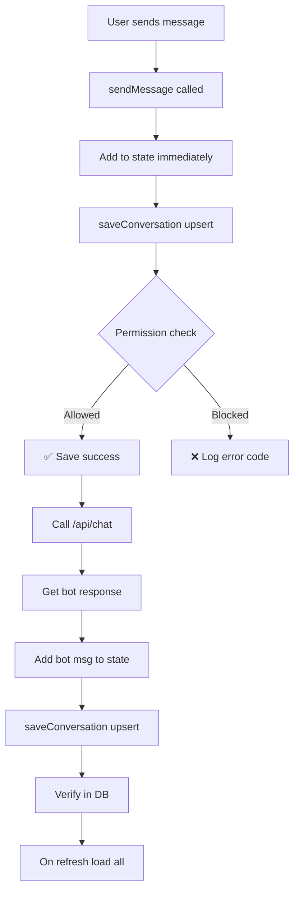

# 📊 Chat Persistence Fix - Complete Summary

## Overview of Changes

The code was enhanced with **7 major improvements** to debug and fix why chat history wasn't persisting.

---

## What Was Changed

### File: `src/contexts/ChatContext.tsx`

#### Change 1: Load Chats - Null Safety
```diff
- messages: row.messages
+ messages: Array.isArray(row.messages) ? row.messages : []
```
**Why:** Database might return null for messages; this prevents undefined errors

#### Change 2: Load Chats - Better Error Logging
```diff
- console.error('Error loading conversations:', error.message || error);
+ console.error('Error loading conversations:', {
+   code: error.code,
+   message: error.message,
+   details: error.details,
+   hint: error.hint,
+ });
```
**Why:** Now you'll see the EXACT error code (42501 = permission denied, etc.)

#### Change 3: Save Conversation - Comprehensive Logging
```diff
+ Added try-catch wrapper
+ Added success logging with chat ID and message count
+ Added detailed error logging with all error properties
```
**Why:** Can now track which saves succeed and which fail, with full error context

#### Change 4: Save Conversation - Null Safety
```diff
  messages: chat.messages || [],
```
**Why:** Ensures messages is never undefined when storing

#### Change 5: Create Chat - Better Error Handling
```diff
+ Added console warnings for missing user session
+ Added success logging for new chats
+ Added detailed error logging
+ Added try-catch wrapper
```
**Why:** Know immediately if chat creation fails and why

#### Change 6: Send Message - Safe Array Spreading
```diff
- messages: [...chat.messages, userMsg],
+ messages: [...(chat.messages || []), userMsg],
```
**Why:** If messages is undefined, this would crash; now it's always safe

#### Change 7: Send Message - Better Response Handling
```diff
- text: data.text,
+ text: data.text || 'Sorry, I did not understand that.',
```
**Why:** API response might be malformed; now there's a fallback

---

## New Diagnostic Files

### 1. `src/lib/debugChat.ts`
A utility function you can run in the browser console:
```javascript
import { debugChatPersistence } from '@/lib/debugChat';
debugChatPersistence();
```
This will:
- ✅ Check if you're logged in
- ✅ Verify the conversations table exists
- ✅ Test INSERT permission
- ✅ Test UPSERT permission
- ✅ Verify data was saved correctly

### 2. `CHAT_PERSISTENCE_FIX.md`
Comprehensive guide covering:
- What was fixed and why
- How to check RLS policies (MOST LIKELY CULPRIT)
- Diagnostic steps
- Database schema checklist
- Console logs to monitor
- Common error codes and solutions

### 3. `QUICK_FIX_CHECKLIST.md`
Quick reference to fix it in 5 minutes:
- RLS checklist
- Console check
- Test direct access
- Expected results

---

## The Root Cause (Most Likely)

### Row-Level Security (RLS) Policies

This is the #1 reason chat doesn't persist:

```
No RLS Policies → All write operations blocked silently
```

**Solution:** Add these 4 policies to `conversations` table in Supabase:

```sql
-- SELECT
CREATE POLICY "Users can view own conversations"
ON public.conversations FOR SELECT
USING (auth.uid() = user_id);

-- INSERT
CREATE POLICY "Users can insert own conversations"
ON public.conversations FOR INSERT
WITH CHECK (auth.uid() = user_id);

-- UPDATE
CREATE POLICY "Users can update own conversations"
ON public.conversations FOR UPDATE
USING (auth.uid() = user_id)
WITH CHECK (auth.uid() = user_id);

-- DELETE
CREATE POLICY "Users can delete own conversations"
ON public.conversations FOR DELETE
USING (auth.uid() = user_id);
```

---

## How to Verify It's Fixed

After applying RLS policies (if needed):

**Step 1: Send a message**
- Should appear in chat immediately ✅

**Step 2: Check console (F12)**
- Should see: `Conversation saved successfully: { id: 'xxx', messageCount: 2 }`
- Should NOT see: Error message

**Step 3: Refresh page**
- Chat history should be there ✅
- Messages should reload from database ✅

**If all 3 work → Fixed! 🎉**

---

## Error Codes You Might See

| Code | Meaning | Fix |
|------|---------|-----|
| `42501` | Permission denied | Add RLS policies |
| `23502` | NOT NULL violation | Ensure user_id provided |
| `23503` | Foreign key error | Ensure user exists in auth |
| `PGRST301` | Table doesn't exist | Create conversations table |
| `invalid_grant` | Auth token expired | Re-login |

---

## Console Logs to Monitor

When you send a message, you should see one of these:

### ✅ Success (What You Want)
```
Conversation saved successfully: { 
  id: 'a1b2c3d4-e5f6-7g8h-i9j0-k1l2m3n4o5p6',
  messageCount: 1 
}
```

Then after bot responds:
```
Conversation saved successfully: { 
  id: 'a1b2c3d4-e5f6-7g8h-i9j0-k1l2m3n4o5p6',
  messageCount: 2 
}
```

### ❌ Error (What to Debug)
```
Error saving conversation: { 
  code: '42501',
  message: 'new row violates row-level security policy',
  details: null,
  hint: null,
  chatId: 'a1b2c3d4-e5f6-7g8h-i9j0-k1l2m3n4o5p6',
  userId: 'x8y9z0-...'
}
```

---

## Technical Details

### Data Flow with Context API



### Message Structure (JSONB in DB)

```json
[
  {
    "id": "msg-1717864225123-0",
    "sender": "user",
    "text": "Hello!",
    "timestamp": "2024-06-08T10:30:25.123Z"
  },
  {
    "id": "msg-1717864225124-1",
    "sender": "bot",
    "text": "Hi! How can I help?",
    "timestamp": "2024-06-08T10:30:26.456Z"
  }
]
```

---

## Next Actions

1. **Read:** `QUICK_FIX_CHECKLIST.md` (5 min read)
2. **Check:** Supabase RLS policies
3. **Add:** Missing policies if needed
4. **Test:** Send a message and check console
5. **Verify:** Message persists after refresh

---

## Files Modified

- ✅ `src/contexts/ChatContext.tsx` - Enhanced error handling and null safety
- ➕ `src/lib/debugChat.ts` - New diagnostic utility
- ➕ `CHAT_PERSISTENCE_FIX.md` - New comprehensive guide
- ➕ `QUICK_FIX_CHECKLIST.md` - New quick reference

**Build Status:** ✅ Compiles successfully
